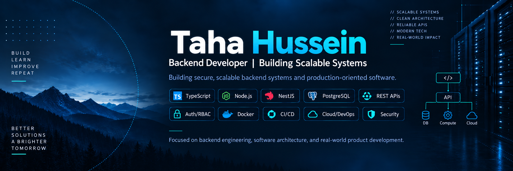

<p align="center">
  
</p>

## Hi, I'm Taha 👋

I'm a **backend-focused software developer based in Germany**, targeting **Junior Backend Developer / Backend Software Engineer** roles.

I build structured, maintainable backend systems with **TypeScript, Node.js, NestJS and PostgreSQL** — from requirements and system design to **REST APIs, data modeling, authentication, RBAC, testing, Docker and CI/CD**.

My goal is simple: turn real-world requirements into reliable software with clear business rules, clean architecture and verifiable engineering decisions.

---

## Featured project

### 🛡️ SecurePlan — B2B SaaS Workforce Planning

SecurePlan is my current flagship engineering project, developed during my **Praxisphase at THM**.

It addresses real backend engineering challenges around:

- role-based access control (RBAC)
- tenant isolation
- complex business rules
- transactional workflows
- concurrency and idempotency
- API and data-model design
- testing and production readiness

**Planned backend stack:** TypeScript · NestJS · PostgreSQL · REST APIs

> The project is intentionally developed in phases. Requirements, architecture and engineering evidence are documented before implementation is marked complete.

[](https://github.com/takh86/SecurePlan-)

---

## Core stack

### Backend


### Engineering


### Supporting experience

`Express.js` · `MySQL` · `MongoDB` · `Java` · `HTML/CSS` · `GraphQL fundamentals`

---

## What I build

| Backend Engineering | Production Engineering | Engineering Practice |
|---|---|---|
| REST APIs | Testing | Requirements |
| Business logic | Docker | System design |
| Authentication & RBAC | CI/CD | Architecture decisions |
| Database-backed services | Monitoring | Verification |
| Maintainable architectures | Security mindset | Human review |

---

## More engineering projects

### ⚙️ DevOps Landing Page — Team Project

Built around a structured **GitLab CI/CD pipeline** covering build, test, security, image packaging, deployment and notifications.

**Technologies:** GitLab CI/CD, Docker, Kaniko, GitLab Container Registry, GitLab Pages, Linux, Power Automate.

**What I practiced:** CI/CD flow, containerization, automated smoke tests, branch/merge workflow and deployment automation.

---

### 📝 User Blog API

REST-based backend application for users and blog posts.

**Technologies:** Node.js, Express.js, MySQL, REST API.

**What I practiced:** authentication basics, centralized error handling, routing/service/data-access separation and modular backend structure.

[](https://github.com/takh86/User-Blog-App)

---

### 🧪 AI Engineering Lab

A separate portfolio for experiments in **human-led, AI-assisted software engineering**.

**Focus:** spec-driven development, bounded AI delegation, cross-model review, quality gates, engineering decision logs and automated verification.

My principle is simple: AI can accelerate engineering work, but architecture, verification and final decisions remain human-owned.

[](https://github.com/takh86/ai-engineering-lab)

---

## AI-assisted engineering workflow

```text
Understand
   ↓
Specify
   ↓
Design
   ↓
Delegate bounded work to AI
   ↓
Test
   ↓
Independent review
   ↓
Human approval
```

I use **ChatGPT and Claude** to accelerate research, critique, implementation and repetitive engineering work — not to replace understanding or ownership.

---

## Current direction

```text
Backend
TypeScript → NestJS → PostgreSQL

Engineering
Testing → Docker → CI/CD

Next layer
Security → Monitoring → Cloud
```

My primary focus is **backend software engineering**. DevOps, Cloud and AI-assisted engineering are supporting capabilities that strengthen how I build and operate software.

---

## Background

- 🎓 **B.Sc. Informatik — Technische Hochschule Mittelhessen (THM)**
- 💻 Backend-focused software development with Node.js / TypeScript
- ⚙️ Practical CI/CD and Docker project experience
- 🏗️ Current flagship project: SecurePlan
- 📍 Gießen, Germany
- 🎯 Target roles: Junior Backend Developer · Backend Software Engineer · Node.js / TypeScript Developer

---

## Let's connect

[](https://www.linkedin.com/in/ingtahahussein/)
[](https://github.com/takh86)
[](mailto:taha.hussein@mni.thm.de)

---

<p align="center">
  <strong>Build deliberately. Verify objectively. Improve continuously.</strong>
</p>
