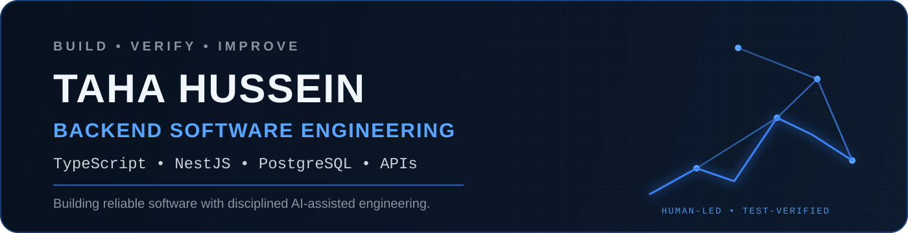

<p align="center">
  
</p>

## Hi, I'm Taha 👋

I'm an **Informatics student at THM in Germany** focused on **backend software engineering** and production-oriented development.

I like turning real-world problems into structured software systems — from **requirements and architecture** to **APIs, databases, testing and deployment**.

My current path is centered on **TypeScript, NestJS, PostgreSQL, REST APIs, authentication, testing, Docker and CI/CD**. I also experiment with AI-assisted development, with one rule: **AI can accelerate the process, but engineering decisions and verification stay human-owned.**

> Previous engineering experience shaped how I approach software: structured thinking, documentation, responsibility and real-world constraints.

---

## What I build

| Backend Systems | Production Engineering | AI-Assisted Engineering |
|---|---|---|
| REST APIs | Testing | Specification |
| Business logic | Docker | Delegation |
| Authentication & RBAC | CI/CD | Verification |
| Database-backed services | Security mindset | Independent review |
| Maintainable architectures | Observability path | Human approval |

---

## Core stack

### Primary


### Engineering


### Supporting experience

`Express.js` · `MySQL` · `MongoDB` · `Java` · `HTML/CSS` · `GraphQL fundamentals`

---

## Featured engineering

### 🛡️ SecurePlan — long-term engineering project

A production-oriented workforce management system developed in the context of my **Praxisphase at THM**.

**Current emphasis:** requirements engineering, system analysis, architecture, business rules, backend design, RBAC, testing and production readiness.

[](https://github.com/takh86/SecurePlan-)

> The project is intentionally developed in phases. Planning and engineering evidence are documented before implementation is marked complete.

---

### 🧪 AI Engineering Lab

A separate portfolio for experiments in **human-led, AI-assisted software engineering**.

**Focus:** spec-driven development, bounded AI delegation, cross-model review, quality gates, engineering decision logs and automated verification.

[](https://github.com/takh86/ai-engineering-lab)

---

### ⚙️ DevOps Landing Page — team project

Built around a structured **GitLab CI/CD pipeline** covering build, test, security, image packaging, deployment and notifications.

**Technologies:** GitLab CI/CD, Docker, Kaniko, GitLab Container Registry, GitLab Pages, Linux, Power Automate.

**What I practiced:** CI/CD flow, containerization, automated smoke tests, branch/merge workflow and deployment automation.

---

### 📝 User Blog API

REST-based backend application for users and blog posts.

**Technologies:** Node.js, Express.js, MySQL, REST API.

**What I practiced:** authentication basics, centralized error handling, routing/service/data-access separation and modular backend structure.

[](https://github.com/takh86/User-Blog-App)

---

## My AI engineering workflow

```text
Understand
   ↓
Specify
   ↓
Design
   ↓
Delegate bounded work to AI
   ↓
Test
   ↓
Independent review
   ↓
Human approval
```

I use **ChatGPT and Claude** to accelerate research, critique, implementation and repetitive engineering work — not to replace understanding or ownership.

**Engineering judgment stays human-owned.**

---

## Current focus

```text
Backend
TypeScript → NestJS → PostgreSQL

Engineering
Testing → Docker → CI/CD

Production
Security → Monitoring → Cloud
```

My goal is to grow from backend implementation into building and operating reliable production systems, with **DevOps and Cloud** as the next layer.

---

## Selected background

- 🎓 **B.Sc. Informatik — Technische Hochschule Mittelhessen (THM)**
- 💻 Backend-focused software development with Node.js / TypeScript
- ⚙️ Practical CI/CD and Docker project experience
- 🧠 Building a disciplined workflow for AI-assisted software engineering
- 📍 Gießen, Germany

---

## Let's connect

[](https://www.linkedin.com/in/ingtahahussein/)
[](https://github.com/takh86)
[](mailto:taha.hussein@mni.thm.de)

---

<p align="center">
  <strong>Build deliberately. Verify objectively. Improve continuously.</strong>
</p>
